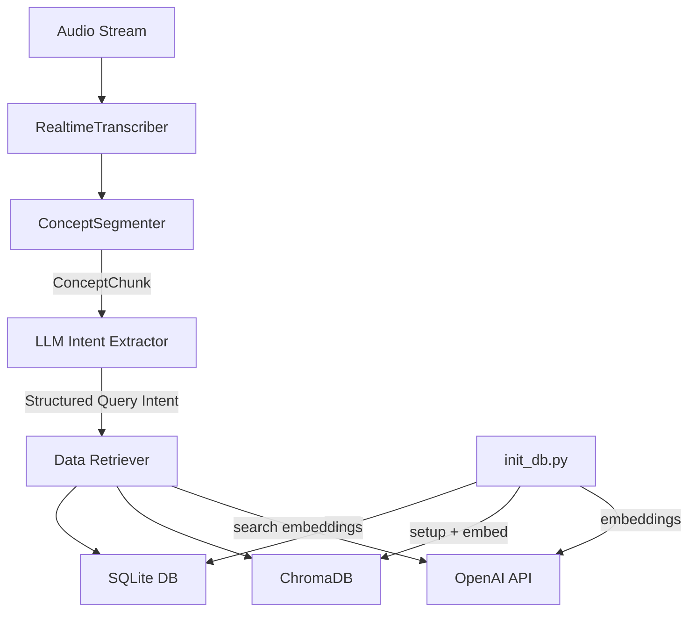

# Design Document: Data Layer

## Overview

The data layer provides a local persistence and retrieval subsystem for the portfolio manager transcription application. It integrates with the existing speech-to-text pipeline by serving as the downstream consumer of `ConceptChunk` events — once the segmenter identifies a concept boundary, the data layer can be queried to retrieve relevant customer data (portfolio, trades, news) that contextualizes the conversation topic.

The system uses two storage engines:
- **SQLite** for structured relational data (portfolio, trades, customer profile, real estate, market movements)
- **ChromaDB** for semantic similarity search over financial news articles

Both databases run locally with no external infrastructure beyond the OpenAI embedding API. An initialization script creates schemas and populates mock data for a single demo customer.

## Architecture



The architecture is a simple layered design:

1. **Storage Layer**: SQLite file + ChromaDB persistent directory, both under a configurable `data/` path
2. **Access Layer**: A Python module (`db.py`) exposing typed query functions with optional filter parameters — no ORM, just parameterized SQL and ChromaDB client calls. All filter params are designed for direct consumption from an LLM's structured output (simple types, optional, additive AND logic).
3. **Intent Layer**: An LLM watches the live transcription stream and produces structured query intents (e.g., `{"action": "show_trades", "ticker": "AAPL", "operation_type": "buy", "since": "2025-01-01T00:00:00Z"}`) that map directly to filter parameters on the access functions — no translation needed.
4. **Integration Layer**: A thin retriever that accepts a `ConceptChunk`, invokes the LLM intent extractor, and calls appropriate access functions with the extracted filter parameters

All filter parameters are optional. Queries use additive AND logic — each supplied filter narrows the result set. Invalid or unrecognized filter values are silently ignored (return unfiltered on that dimension) to keep the system resilient to LLM hallucinations.

All components are synchronous (SQLite and ChromaDB are blocking I/O) wrapped in `asyncio.to_thread` where needed for pipeline integration.

### LLM Intent → Filter Mapping

The LLM produces structured JSON intents from the transcription. Each intent field maps directly to a filter parameter on the access functions — no translation layer needed. Examples:

| Transcription excerpt | Structured intent | Mapped function call |
|----------------------|-------------------|---------------------|
| "Show me recent tech trades" | `{"action": "trades", "since": "2025-01-01T00:00:00Z"}` | `get_trades(since="2025-01-01T00:00:00Z")` |
| "What did we buy last week?" | `{"action": "trades", "operation_type": "buy", "since": "2025-05-19T00:00:00Z"}` | `get_trades(operation_type="buy", since="2025-05-19T00:00:00Z")` |
| "What real estate do we have in Zurich?" | `{"action": "real_estate", "location": "Zurich"}` | `get_real_estate(location="Zurich")` |
| "Show commercial properties over 2M" | `{"action": "real_estate", "property_type": "commercial", "min_value": 2000000}` | `get_real_estate(property_type="commercial", min_value=2000000)` |
| "How did AAPL move today?" | `{"action": "market_movements", "ticker": "AAPL"}` | `get_market_movements(ticker="AAPL")` |
| "What's dropping in tech?" | `{"action": "market_movements", "sector": "technology", "direction": "down"}` | `get_market_movements(sector="technology", direction="down")` |
| "Show losing positions" | `{"action": "portfolio", "max_profit_loss": 0}` | `get_portfolio(max_profit_loss=0)` |
| "How's our energy exposure?" | `{"action": "portfolio", "sector": "energy"}` | `get_portfolio(sector="energy")` |

## Components and Interfaces

### 1. Database Access Module (`speech-to-text/src/data/db.py`)

The primary interface for the rest of the application. All filter parameters are optional — when `None`, that filter is not applied. Multiple filters combine with AND logic. Invalid filter values are silently ignored.

These functions are designed to be called directly from an LLM's structured output. The intent detection layer (out of scope) produces a JSON intent from live call transcription, and each intent field maps 1:1 to a filter parameter here. This keeps the interface "sufficiently queryable" for narrowing dashboard data without requiring the LLM to compose SQL.

```python
def get_portfolio(
    ticker: str | None = None,
    sector: str | None = None,
    min_profit_loss: float | None = None,
    max_profit_loss: float | None = None,
) -> list[dict]:
    """Return stock positions with optional filters.
    
    - ticker: exact match on stock ticker (case-insensitive)
    - sector: exact match on sector (case-insensitive)
    - min_profit_loss: only positions with profit_loss >= this value
    - max_profit_loss: only positions with profit_loss <= this value (useful for showing losses)
    """

def get_trades(
    ticker: str | None = None,
    operation_type: str | None = None,
    since: str | None = None,
    until: str | None = None,
    min_value: float | None = None,
    limit: int = 50,
) -> list[dict]:
    """Return trades with optional filters, ordered by timestamp desc.
    
    - ticker: exact match (case-insensitive)
    - operation_type: one of 'buy', 'sell', 'short_sell', 'short_cover'
    - since: ISO 8601 datetime string, return only trades after this date
    - until: ISO 8601 datetime string, return only trades before this date
    - min_value: only trades with value >= this amount
    - limit: max results (default 50, clamped 1-200)
    """

def get_customer_profile() -> dict:
    """Return the single customer profile."""

def get_real_estate(
    property_type: str | None = None,
    status: str | None = None,
    location: str | None = None,
    min_value: float | None = None,
    max_value: float | None = None,
) -> list[dict]:
    """Return real estate investments with optional filters, ordered by acquisition_date desc.
    
    - property_type: one of 'residential', 'commercial', 'industrial', 'land'
    - status: one of 'active', 'sold', 'under_contract'
    - location: partial match (SQL LIKE '%location%')
    - min_value: only properties with current_value >= this amount
    - max_value: only properties with current_value <= this amount
    """

def get_market_movements(
    ticker: str | None = None,
    min_change_percent: float | None = None,
    direction: str | None = None,
    since: str | None = None,
    sector: str | None = None,
    limit: int = 50,
) -> list[dict]:
    """Return market movements with optional filters, ordered by timestamp desc.
    
    - ticker: exact match (case-insensitive)
    - min_change_percent: only movements with abs(percentage_change) >= this value
    - direction: 'up' (price_change > 0) or 'down' (price_change < 0)
    - since: ISO 8601 datetime string, return only movements after this date
    - sector: exact match (case-insensitive)
    - limit: max results (default 50, clamped 1-200)
    """

def search_news(query: str, top_k: int = 5, category: str | None = None, ticker: str | None = None) -> list[dict]:
    """Semantic search over news collection. Returns top_k results above similarity threshold."""
```

Each function:
- Opens a connection to the appropriate database (or reuses a module-level connection)
- Returns plain dictionaries (column-name keys for SQLite rows, metadata+document for ChromaDB)
- Silently ignores invalid filter values (e.g., `operation_type="invalid"` is treated as no filter on that field)
- Raises `DataLayerError` if the database is unreachable

### 2. Schema Definition (`speech-to-text/src/data/schema.sql`)

A SQL file containing all CREATE TABLE statements with constraints (CHECK constraints for enums, ranges). Used by both the init script and tests.

### 3. Initialization Script (`speech-to-text/src/data/init_db.py`)

Runnable as `python -m src.data.init_db` from the `speech-to-text/` directory. Responsibilities:
- Drop and recreate all SQLite tables
- Drop and recreate the ChromaDB `market_news` collection
- Insert mock data for the demo customer
- Print record counts on success
- Exit non-zero with error message if OpenAI embedding API fails

### 4. Data Retriever (`speech-to-text/src/data/retriever.py`)

A thin integration layer that maps a `ConceptChunk` to data layer queries via LLM-structured intents:

```python
async def retrieve_context(chunk: ConceptChunk) -> dict:
    """Given a concept chunk, extract structured query intent and return relevant data.
    
    The LLM intent extractor analyzes the chunk summary/entities and produces
    a structured intent dict. The retriever maps intent fields directly to filter
    parameters on the access functions (1:1 mapping, no translation).
    
    Example flow:
      chunk.summary = "client asking about tech stock movements"
      → LLM intent: {"action": "market_movements", "sector": "technology"}
      → get_market_movements(sector="technology")
      
      chunk.summary = "discussing recent purchases above 100K"
      → LLM intent: {"action": "trades", "operation_type": "buy", "min_value": 100000}
      → get_trades(operation_type="buy", min_value=100000)
    """
```

This enables the pipeline to call `retrieve_context(chunk)` in the `on_trigger` callback and get a bundle of relevant data filtered to the conversation topic.

## Data Models

### SQLite Tables

#### `portfolio`
| Column | Type | Constraints |
|--------|------|-------------|
| id | INTEGER | PRIMARY KEY AUTOINCREMENT |
| ticker | TEXT | NOT NULL, max 10 chars |
| quantity | INTEGER | NOT NULL, CHECK(quantity >= 1) |
| purchase_price | REAL | NOT NULL, CHECK(0.01 <= purchase_price <= 999999999.99) |
| current_price | REAL | NOT NULL, CHECK(0.01 <= current_price <= 999999999.99) |
| profit_loss | REAL | GENERATED AS (current_price - purchase_price) * quantity |
| currency | TEXT | NOT NULL, CHECK(length(currency) = 3) |
| sector | TEXT | max 50 chars |

#### `trade_operations`
| Column | Type | Constraints |
|--------|------|-------------|
| id | INTEGER | PRIMARY KEY AUTOINCREMENT |
| ticker | TEXT | NOT NULL, max 10 chars |
| quantity | INTEGER | NOT NULL, CHECK(quantity > 0) |
| value | REAL | NOT NULL, CHECK(0.01 <= value <= 999999999.99) |
| operation_type | TEXT | NOT NULL, CHECK(IN 'buy','sell','short_sell','short_cover') |
| timestamp | TEXT | DEFAULT (strftime('%Y-%m-%dT%H:%M:%SZ','now')) |

#### `customer_profile`
| Column | Type | Constraints |
|--------|------|-------------|
| id | INTEGER | PRIMARY KEY |
| name | TEXT | NOT NULL, max 200 chars |
| risk_appetite | TEXT | NOT NULL, CHECK(IN 'conservative','moderate','aggressive') |
| investment_horizon | TEXT | NOT NULL, CHECK(IN 'short_term','medium_term','long_term') |
| esg_preference | TEXT | NOT NULL, CHECK(IN 'none','moderate','strong') |
| preferred_sectors | TEXT | max 5 comma-separated entries |
| total_aum | REAL | CHECK(total_aum >= 0) |
| kyc_status | TEXT | NOT NULL, CHECK(IN 'verified','pending','expired') |
| onboarding_date | TEXT | format YYYY-MM-DD |

#### `real_estate_investments`
| Column | Type | Constraints |
|--------|------|-------------|
| id | INTEGER | PRIMARY KEY AUTOINCREMENT |
| property_type | TEXT | NOT NULL, CHECK(IN 'residential','commercial','industrial','land') |
| location | TEXT | NOT NULL, max 255 chars |
| current_value | REAL | NOT NULL, CHECK(0.01 <= current_value <= 999999999.99) |
| acquisition_price | REAL | NOT NULL, CHECK(0.01 <= acquisition_price <= 999999999.99) |
| acquisition_date | TEXT | NOT NULL, format YYYY-MM-DD |
| rental_yield_percent | REAL | CHECK(0.00 <= rental_yield_percent <= 100.00) |
| status | TEXT | NOT NULL, CHECK(IN 'active','sold','under_contract') |

#### `market_movements`
| Column | Type | Constraints |
|--------|------|-------------|
| id | INTEGER | PRIMARY KEY AUTOINCREMENT |
| ticker | TEXT | NOT NULL, max 10 chars |
| company_name | TEXT | max 100 chars |
| sector | TEXT | max 50 chars |
| price_change | REAL | NOT NULL |
| percentage_change | REAL | NOT NULL |
| current_price | REAL | NOT NULL, CHECK(current_price > 0) |
| volume | INTEGER | CHECK(volume >= 0) |
| timestamp | TEXT | NOT NULL, ISO 8601 UTC |

### ChromaDB Collection

**Collection name**: `market_news`

| Field | Description |
|-------|-------------|
| document | News article text (max 8000 chars) |
| embedding | Vector from text-embedding-3-small (1536 dimensions) |
| metadata.source | Origin of the article (e.g., "Reuters", "Bloomberg") |
| metadata.category | Article category (e.g., "equity", "geopolitical", "macro") |
| metadata.published_date | ISO 8601 date string |
| metadata.tickers_mentioned | List of ticker symbols mentioned in the article |

### Configuration

Database paths are resolved relative to the `speech-to-text/` directory by default:
- SQLite: `data/portfolio.db`
- ChromaDB: `data/chroma/`

Configurable via environment variables:
- `DATA_SQLITE_PATH` — override SQLite file path
- `DATA_CHROMA_PATH` — override ChromaDB persistent directory
- `OPENAI_API_KEY` — required for embedding generation (already in .env)

## Correctness Properties

*A property is a characteristic or behavior that should hold true across all valid executions of a system — essentially, a formal statement about what the system should do. Properties serve as the bridge between human-readable specifications and machine-verifiable correctness guarantees.*

### Property 1: Data round-trip preservation

*For any* set of valid portfolio records (valid ticker length, quantity >= 1, prices in range), inserting them into the database and then calling `get_portfolio()` SHALL return a list containing all inserted records with identical field values.

**Validates: Requirements 1.2, 8.1**

### Property 2: Constraint violation rejection

*For any* record with an invalid field value (ticker > 10 chars, quantity < 1, operation_type not in allowed set, risk_appetite not in allowed set, property_type not in allowed set, or numeric values outside defined ranges), attempting to insert that record SHALL raise a constraint violation error and the database state SHALL remain unchanged.

**Validates: Requirements 1.3, 2.2, 3.2, 3.3, 3.4, 3.5, 4.2, 4.3, 4.5**

### Property 3: Query ordering and limit enforcement

*For any* set of N records inserted into trade_operations, real_estate_investments, or market_movements tables, the corresponding query function SHALL return results ordered by their sorting column (timestamp or acquisition_date) in descending order, and the result count SHALL never exceed the function's limit parameter.

**Validates: Requirements 2.3, 4.4, 5.2, 8.2, 8.4**

### Property 4: Case-insensitive ticker filtering

*For any* ticker string T and any set of market movement records where some records have ticker equal to T (in any case combination), calling `get_market_movements(ticker=T)` SHALL return exactly those records whose ticker matches T case-insensitively, and no others.

**Validates: Requirements 5.3**

### Property 5: Initialization idempotency

*For any* initial state of the databases (empty, partially filled, or fully populated), running the initialization script SHALL produce the same final state — all tables recreated with the expected mock data counts.

**Validates: Requirements 7.4**

### Property 6: Parameter clamping

*For any* integer value passed as the `limit` parameter to `get_market_movements()` or the `top_k` parameter to `search_news()`, the function SHALL clamp the effective value to its valid range (1–200 for limit, 1–20 for top_k) and never return more results than the clamped value.

**Validates: Requirements 8.5, 8.6**

## Error Handling

| Scenario | Behavior |
|----------|----------|
| SQLite database file missing or corrupt | `DataLayerError` raised with message identifying SQLite as unavailable |
| ChromaDB directory missing or inaccessible | `DataLayerError` raised with message identifying ChromaDB as unavailable |
| OpenAI embedding API unreachable during search | `DataLayerError` raised with message indicating embedding generation failed; no partial results returned |
| OpenAI embedding API unreachable during init | Script exits with non-zero code and prints error to stderr |
| Invalid parameters (negative limit, top_k > 20) | Parameters clamped silently to valid range (no error) |
| Query returns no results | Empty list returned (not an error) |
| Constraint violation on insert | `sqlite3.IntegrityError` propagated to caller |

**Error class hierarchy:**

```python
class DataLayerError(Exception):
    """Base exception for data layer failures."""
    pass
```

Simple single exception type — hackathon scope doesn't warrant a complex hierarchy.

## Testing Strategy

### Unit Tests (pytest)

- **Schema correctness**: Verify each table has expected columns, types, and constraints after creation
- **Mock data counts**: Verify init script inserts minimum required records
- **Default timestamp**: Verify trade operations get UTC timestamp when none provided
- **Error messages**: Verify correct error messages for unreachable databases (mock file paths)
- **Edge cases**: Empty result sets, single customer profile retrieval

### Property-Based Tests (Hypothesis)

Library: [Hypothesis](https://hypothesis.readthedocs.io/) — the standard PBT library for Python.

Configuration:
- Minimum 100 examples per property test (`@settings(max_examples=100)`)
- Each test tagged with design property reference

Tests operate against an in-memory SQLite database (`:memory:`) for speed and isolation. ChromaDB tests use a temporary directory with a mock embedding function (returns fixed-dimension random vectors) to avoid OpenAI API calls during testing.

| Property | Test Tag |
|----------|----------|
| Property 1 | `Feature: data-layer, Property 1: Data round-trip preservation` |
| Property 2 | `Feature: data-layer, Property 2: Constraint violation rejection` |
| Property 3 | `Feature: data-layer, Property 3: Query ordering and limit enforcement` |
| Property 4 | `Feature: data-layer, Property 4: Case-insensitive ticker filtering` |
| Property 5 | `Feature: data-layer, Property 5: Initialization idempotency` |
| Property 6 | `Feature: data-layer, Property 6: Parameter clamping` |

### Integration Tests

- **ChromaDB semantic search**: Insert known documents, search with related query, verify ranked results
- **Metadata filtering**: Insert documents with varied metadata, filter by category/ticker, verify correct subset returned
- **Full init + query flow**: Run init script, then exercise all query functions, verify non-empty results

### Test Dependencies

Add to `requirements.txt` (dev):
```
pytest>=7.0
hypothesis>=6.0
chromadb>=0.4.0
```

Production dependencies to add:
```
chromadb>=0.4.0
```

